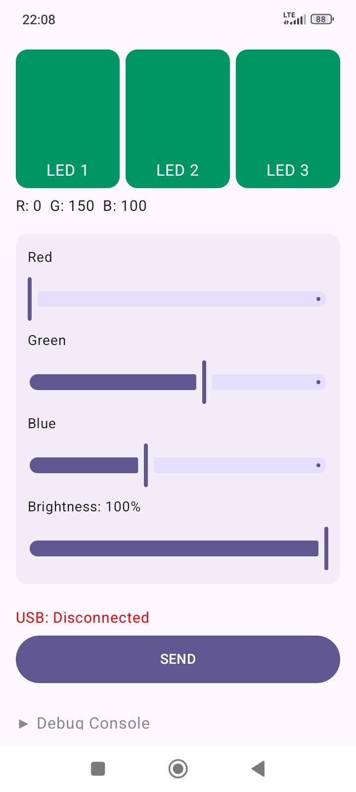
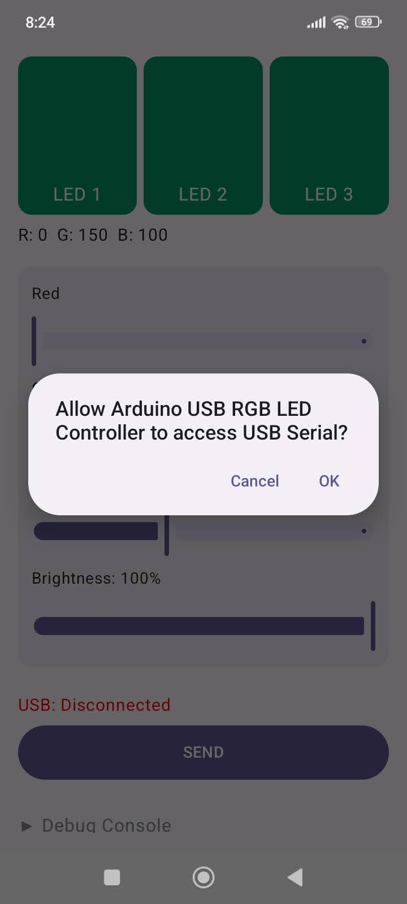
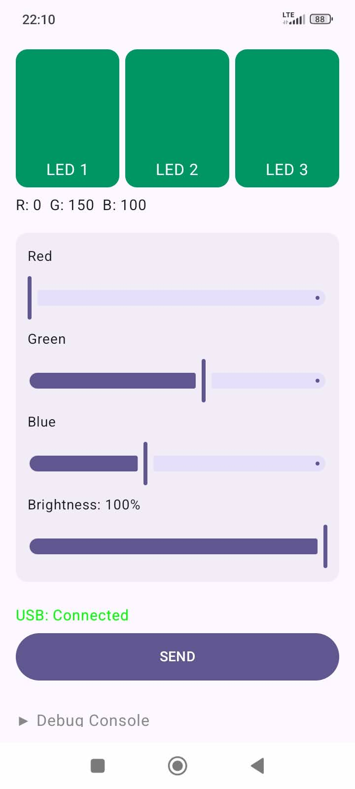
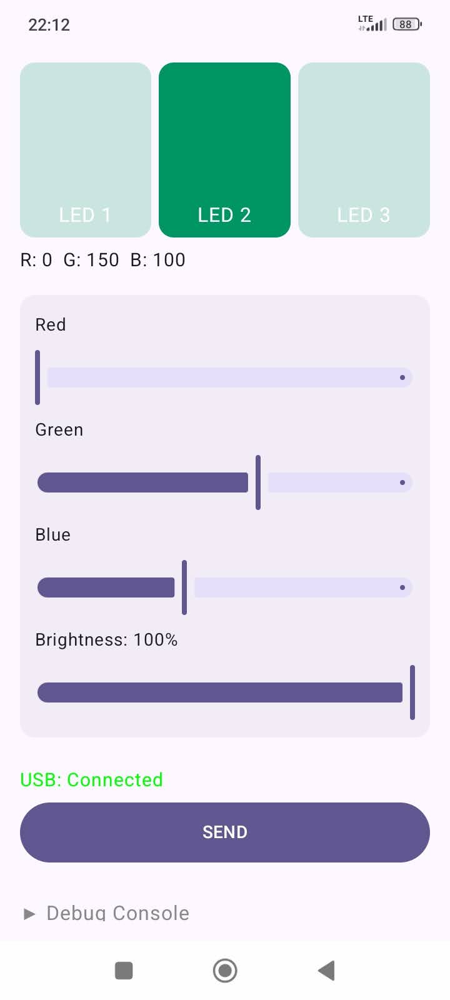
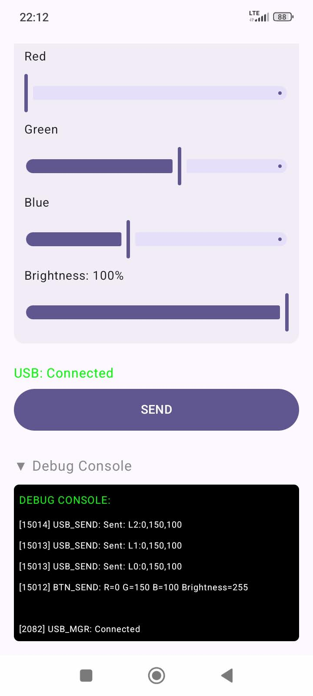

<p align="center" width="100%">
    
    
    
</p>

#  Arduino USB RGB LED Controller

Android application + Arduino firmware for controlling 3× built-in **RGB LEDs** on a 3rd party **Arduino Super Mini board** via **OTG USB**.

The Android app communicates with the Arduino via USB and controls the onboard RGB LEDs connected to pin D2, sending RGB and brightness values in real time.

<br>

---

## Project structure

- android-app/ — Android application (Jetpack Compose)
- releases — Final Android APK package to install on your phone, link here: [GitHub Releases page](https://github.com/Urobotos/Arduino-USB-RGB-LED-Controller/releases)
- arduino/ — Arduino firmware (.ino) for SuperMini / Nano-compatible board
- images/ — photos and screenshots


<br>

---

## ✨ Features

* 🎨 RGB color control (Red / Green / Blue sliders)
* 🔆 Global brightness control (0–100%)
* 💡 Enable / disable individual LEDs
* 🔁 Solo LED mode (long-press)
* 🔌 USB connection status
* 🐞 Debug console (expandable)
* 🚫 No ads, no tracking, no data collection

<br>

---

## 📱 Requirements

* Android device with **USB OTG support**
* **USB OTG adapter or OTG cable (REQUIRED)**
* Android 8.0 (API 26) or newer recommended
* Arduino connected via USB
* Arduino SuperMini board with **3 built-in RGB LEDs**
> ⚠️ Note: The board name "Super Mini" is commonly used by 3rd party vendors and does not refer to an official Arduino product.

<br>

---

## ⚙️ Setup for Arduino Firmware:

📂 Download <a href="/arduino/Arduino-USB-RGB-LED-Controller.ino">Arduino-USB-RGB-LED-Controller.ino</a> file from `arduino/` directory <br>

📂 Open downloaded `Arduino-USB-RGB-LED-Controller.ino` file in Arduino IDE <br><br>

🔌 Connect your Arduino SuperMini board to the PC via USB <br><br>

**In Arduino IDE, select:**

- **Board:** `Arduino Nano`
- **Processor:** `ATmega328P (Old Bootloader)`
- **Port:** (the COM port where the board appears)<br><br>


📦 **Install required library:** <br>
  &nbsp; &nbsp; &nbsp; (This project uses WS2812 / NeoPixel RGB LEDs)
  
- Open Library Manager (📓 icon on the left bar)
- Search for: `Adafruit NeoPixel`
- Install `Adafruit NeoPixel (by Adafruit)` <br><br>


🚀 **Upload firmware:**
- Now you can click the **Upload button** in the IDE &nbsp; <br><br>

✔️ After successful upload, the Arduino is ready to communicate with the Android app via USB. <br>
ℹ️ If upload fails, double-check that "Old Bootloader" is selected.


<br>

---

## ⚙️ Setup for Android App:
You can install the prepared release APK directly, build the APK manually, or open and build the project in Android Studio. <br><br>

📂 **Project structure:** <br>
The Android project is located in: <br> 

```
android-app/
```

*All Gradle commands must be executed inside this folder!*

<br>

### 🛠️ Option A): Install prepared release APK (recommended)

1️⃣ Download the latest release APK from the [GitHub Releases page](https://github.com/Urobotos/Arduino-USB-RGB-LED-Controller/releases) <br>
Look for the asset named similar to `arduino-usb-rgb-led-controller-v1.0.0.apk`.<br><br>

2️⃣ Transfer the APK file to your Android phone.<br>
You can use `Google Drive`, `email`, `USB cable`, or any file transfer method.<br><br>

3️⃣ On your Android phone, open the APK file using a `File manager` app.<br>
You may be prompted to allow installation of apps from unknown sources — accept and confirm.<br><br>

4️⃣ Install the app.<br>
Once installed, you can launch it from your app drawer.

<br>

---

### 🛠️ Option B): Build APK using command line (Gradle)

1️⃣ **Open terminal / PowerShell:** <br>
Navigate to the project root and then into android-app: 

```
cd android-app
```

<br>

2️⃣ **Build debug APK:**  <br>
Run: 

```
./gradlew assembleDebug
```

<br>
On Windows, you can also use:

```
.\gradlew assembleDebug
```

<br>
Or in the Android Studio (UI version of assembling APK): <br>

```
Click the menu symbol ☰ at the top:
Select Build ➜ Generate App Bundles or APKs ➜ Generate APKs
```

<br>

3️⃣ **Locate the APK:** <br>
After a successful build, the APK will be created at:

```
android-app/app/build/outputs/apk/debug/app-debug.apk
```

<br>

4️⃣ **After that, You can manually install this APK on your Android phone:** <br>
Move the `app-debug.apk` to your phone (via Google Drive etc.) and open it via `File Manager`, you will be asked to allow the installation of 3rd party apps, confirm that. <br>

*(permission may vary depending on phone and Android version)*


<br>

### 🛠️ Option C): Open project in Android Studio

*(Direct installation of the application using Android Studio on a phone with a connected USB cable)*

1️⃣ Open Android Studio <br>
2️⃣ Select Open and choose the `android-app` folder <br>
3️⃣ Wait for Gradle sync to finish <br>
4️⃣ Connect your Android phone via USB (with USB debugging enabled) <br>
5️⃣ Check in `LogCat` (cat icon in the left panel) that your phone is connected to Android Studio <br>
6️⃣ Click Run ▶️ <br>

Android Studio will build and install the app automatically.


<br>

## 🔌 USB Connection of Android to Arduino board:

1. Connect the Arduino board to your Android device using a **USB OTG adapter/cable**
2. Launch the app
3. Grant USB permission when prompted
4. The status text in the app should show **USB: Connected**

If the device is disconnected or permission is revoked, the app will update the status automatically.

<br>

---

## 📱 App Screenshots:

<br>
<p align="center" width="100%" text="strong">
    &nbsp; USB Disconnected: &nbsp; &nbsp;&nbsp;&nbsp;&nbsp;
    &nbsp;&nbsp; USB Permission: &nbsp; &nbsp;
    &nbsp;&nbsp; USB Connected: &nbsp;
    &nbsp; &nbsp; &nbsp; Only one LED active: 
    &nbsp; &nbsp; &nbsp; Debug Console: &nbsp; &nbsp;
</p>
<p align="center" width="100%">
    
    
    
    
    
</p>

<br><br>

---

## 🚀 Usage

1. Adjust **Red, Green, Blue** sliders to set the base color
2. Adjust **Brightness** slider to control overall intensity
3. Tap LED tiles to enable/disable individual LEDs
4. Long-press an LED tile to enter **solo mode**
5. Press **SEND** to transmit values to the Arduino

If brightness is set to 0% or all color tiles are disabled, the app will turn all LEDs off.

<br>

---

## 🐞 Debug Console

* Expandable debug console is available at the bottom of the UI
* Shows USB events, permissions, and sent values
* Useful for development and troubleshooting

<br>

---

## 🛠 Development

* Written in **Kotlin**
* UI built with **Jetpack Compose**
* USB communication handled via custom `UsbSerialManager`
* No third-party analytics or advertising libraries

<br>

---

## 📦 Distribution

* **GitHub Releases**
* Planned for **Google Play Store** (free, no ads)

<br>

---

## 📄 License

<a href="/LICENSE">MIT License</a>

<br>

---

## 🙌 Acknowledgements

Inspired by hardware-level RGB control and simple USB-based tools for makers.<br>

Feel free to open issues or pull requests if you want to improve or extend the project.

<br>

