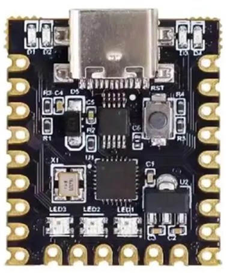
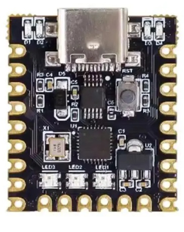
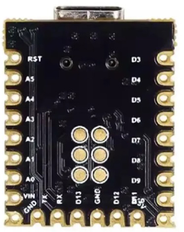

<p align="center" width="100%">
    
    
    
</p>


# Arduino-USB-RGB-LED-Controller

Android application for controlling **3× built-in RGB LEDs** on Arduino-compatible boards (such as 3dparty **Arduino Nano Super Mini** ) via **USB OTG**.

The app allows you to set RGB color, global brightness, enable/disable individual LEDs, and send values directly to the board over USB serial communication.

---

## ✨ Features

* 🎨 RGB color control (Red / Green / Blue sliders)
* 🔆 Global brightness control (0–100%)
* 💡 Enable / disable individual LEDs
* 🔁 Solo mode (long-press an LED to enable only that one)
* 🔌 USB connection status indicator
* 🐞 Built-in debug console (expandable)
* 🚫 No ads, no tracking, no data collection

---

## 📱 Requirements

### Android

* Android device with **USB OTG support**
* **USB OTG adapter or OTG cable** (required)
* Android 8.0 (API 26) or newer recommended

### Hardware

* Arduino Nano SuperMini board with **3 built-in RGB LEDs**
> ⚠️ Note: The board name "Super Mini" is commonly used by vendors and does not refer to an official Arduino product.

---

## 🔌 USB Connection

1. Connect the Arduino board to your Android device using a **USB OTG adapter/cable**
2. Launch the app
3. Grant USB permission when prompted
4. The status text should show **USB: Connected**

If the device is disconnected or permission is revoked, the app will update the status automatically.

---

## 🚀 Usage

1. Adjust **Red, Green, Blue** sliders to set the base color
2. Adjust **Brightness** slider to control overall intensity
3. Tap LED tiles to enable/disable individual LEDs
4. Long-press an LED tile to enter **solo mode**
5. Press **SEND** to transmit values to the Arduino

If brightness is set to 0% or all LEDs are disabled, the app will turn all LEDs off.

---

## 🐞 Debug Console

* Expandable debug console is available at the bottom of the UI
* Shows USB events, permissions, and sent values
* Useful for development and troubleshooting

---

## 🛠 Development

* Written in **Kotlin**
* UI built with **Jetpack Compose**
* USB communication handled via custom `UsbSerialManager`
* No third-party analytics or advertising libraries

### Build

You can build the app using **Android Studio**:

```bash
./gradlew assembleDebug
```

Or generate a release APK/AAB for distribution.

---

## 📦 Distribution

* Planned for **GitHub Releases**
* Planned for **Google Play Store** (free, no ads)

---

## 📄 License

MIT License

---

## 🙌 Acknowledgements

Inspired by hardware-level RGB control and simple USB-based tools for makers.

---

Feel free to open issues or pull requests if you want to improve or extend the project.

